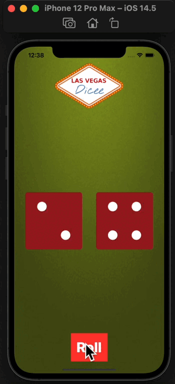

## Dicee-SwiftUI

I built this a Las Vegas dice app with SwiftUI. You can make the die roll at the press of a button or by shaking your phone. With this app in your pocket, you’ll be fully set up to settle any score on the go!

 </img> 

## What you will learn

* Create an app with behaviour and functionality SwiftUI
* Understand and use SwiftUI
* Learn about randomisation and how to generate random numbers in Swift.